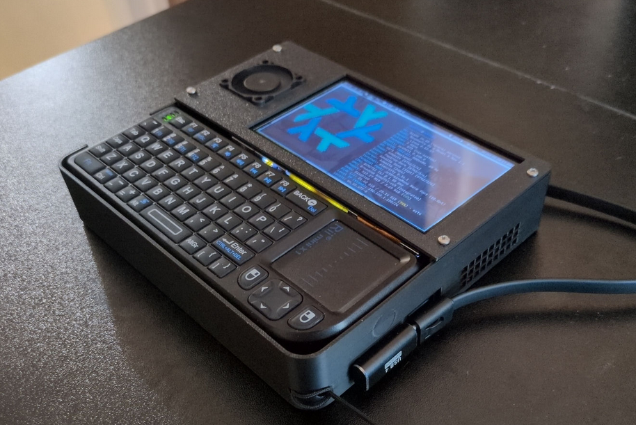
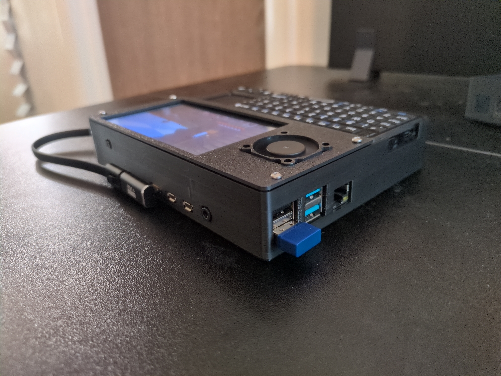
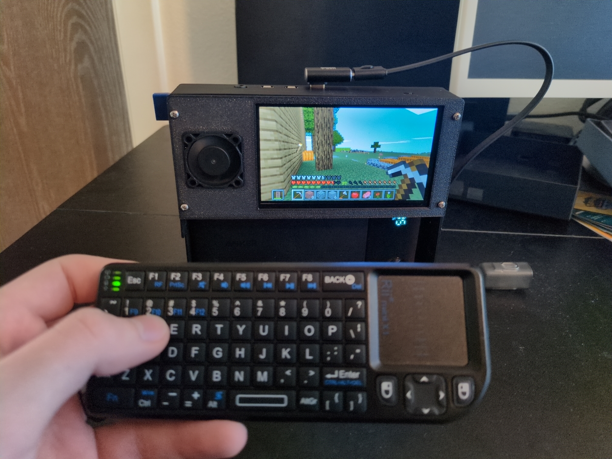
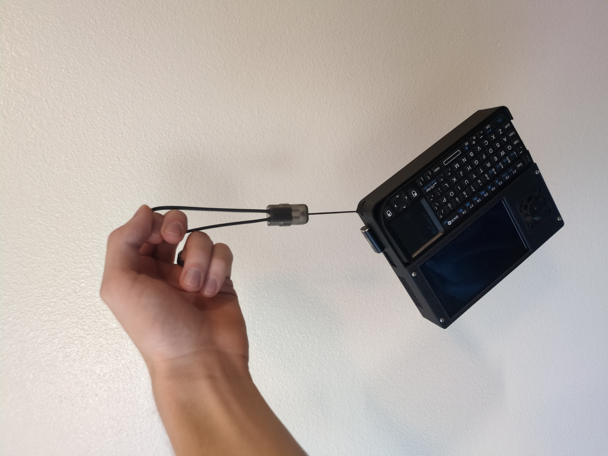

# SimpleDeck

A Glueless, Solderless Raspberry Pi 4 Cyberdeck

## Features

- Removable wireless keyboard + touchpad
- 6+ hours of battery life
- Touchscreen display
- Active cooling
- Simple, non-destructive assembly
- Power cable doubles as lanyard

| Exposes all the main Raspberry Pi ports | Suitable for lightweight gaming | Portable! |
| - | - | - |
|  |  |  |

## Parts required

- Raspberry Pi 4 Model B
- Miniature 5V Cooling Fan \[[link](https://www.adafruit.com/product/4468)\]
- 4.3 Inch 800x480 DSI Touch Screen \[[link](https://www.aliexpress.com/item/3256807896146352.html)\]
- Rii X1 2.4GHz Mini Wireless Keyboard (be sure to select the correct language/layout for your needs!) \[[link](https://www.aliexpress.com/item/3256804879544433.html)\]
- Anker 10,000mAh, 22.5W Power Bank (Note that this one is 6 inches long! Newer models are smaller and their ports are arranged slightly different) \[[link](https://www.bestbuy.com/product/anker-power-bank-10000mah-22-5w-black/JJ858RCW2K/)\]
- Two 90-degree USB-C adapters \[[link](https://www.amazon.com/gp/product/B0BNMDRWR6)\]
- Four M2x8mm screws

## Assembly Instructions

1. Gather parts, 3D print box and lid
2. Slide the Pi into the port holes, snap it down onto the lower support beams
3. Slide battery in, upper edge first
4. Connect fan and display to Pi with their respective cables and ports
5. Fit fan into place on the lid, set display into the shelves found on the inside of the box
6. Screw lid onto case
7. Connect wireless keyboard dongle to any USB port on Pi, set keyboard into place
8. Connect USB-C angle adapters and thread lanyard through battery

## Dev Instructions

- `nix develop`
- `openscad src/box.scad`

## Software

- The case was modeled using [OpenSCAD](https://openscad.org/)
- My NixOS configuration for the Raspberry Pi itself can be found in my [dotfiles repository](https://github.com/pgattic/dotfiles/tree/main/hosts/cyberpi), but Raspberry Pi OS works perfectly fine.

## Thanks

- [chrisicksix](https://makerworld.com/en/@chrisicksix) on MakerWorld for sharing your [cyberdeck](https://makerworld.com/en/models/1440390-cyberdeck-raspberry-pi-4-5). I started by printing your shell, and then decided I would model my own with a similar but more complex design
- BambuLabs for making 3D printing simple and accessible
- OpenSCAD for making CAD so simple for software nerds

